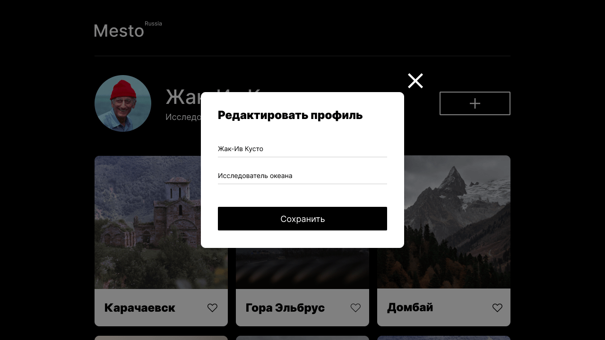

# Проект: Место
### Проектная работа №4, 5, 6
___
_Проект "Место" посвящен работе над сервисом Mesto: интерактивной страницей, куда можно добавлять фотографии, удалять их и ставить лайки._
___




Проект представляет собой адаптивный, одностраничный сайт.
Для реализации проекта использованы флексбокс-вёрстка, гриды, продвинутая семантика языка HTML и JavaScript.
Файловая структура оформлена по правилам БЭМ Nested.

Затемнение кнопок при наведении курсора реализовано с использованием трансформации и ```:hover```.

Реализованы следующие попапы:
* попап редактирования профиля с двумя полям: «Имя» и «О себе», с кнопкой «Сохранить»,
* попап добавления новой карточки с двумя полям: «Имя карточки» и «Ссылка на картинку», с кнопкой «Создать»,
* попап просмотра фотографий.

**Функционал**
* Редактирование профиля: «Имя» и «О себе»
* Добавление фотографий и лайков
* Удаление фотографий
* Просмотр фотографий в увеличенном масштабе
* Плавное открытие и закрытие попапов
* Закрытие попапов кликом на оверлей и нажатием на Esc
* Валидация попапа редактирования профиля и попапа добавления новой карточки (использованы стандартные браузерные тексты ошибок)


**Технологии**
* HTML 5
* CSS 3
  * Flexbox;
  * Grid Layout;
  * Positioning;
  * Adaptive UI;
  * Media Queries;
* JavaScript
* БЭМ Nested

**Планы по доработке проекта**
* Редактирование аватара


**GitHub Pages**
* [Ссылка на проект на GitHub](https://vixen86.github.io/mesto/)

**Figma**

* [Ссылка на макет в Figma для Проектной работы №4](https://www.figma.com/file/2cn9N9jSkmxD84oJik7xL7/JavaScript.-Sprint-4?node-id=0%3A1)
* [Ссылка на макет в Figma для Проектной работы №5](https://www.figma.com/file/bjyvbKKJN2naO0ucURl2Z0/JavaScript.-Sprint-5?type=design&node-id=0-1&t=ddzeOktENPTGcbAm-0)
* [Ссылка на макет в Figma для Проектной работы №6](https://www.figma.com/file/kRVLKwYG3d1HGLvh7JFWRT/JavaScript.-Sprint-6?type=design&node-id=0-1&t=laRsLElFZBLBVkv8-0)
